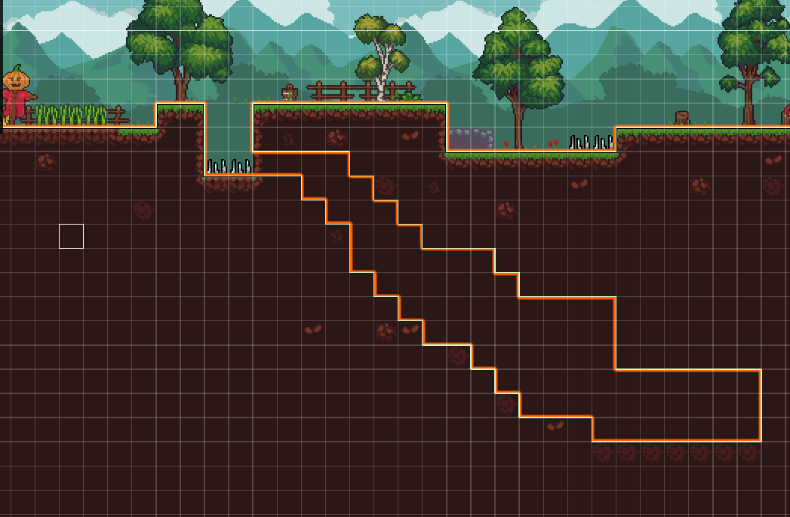

# Lost Game 1

## Solution

Il suffisait simplement de jouer le jeu et perdre décors le premier piège.

Pour trouver le flag, il faut se rendre à la grotte cachée. Le passage se trouve au fond des premiers spikes creux se trouvant dans le chemin. Le spike permettant de rentrer dans la grotte ne fait pas de dégâts.

Pour trouver le flag, il faut se rendre au fond de la grotte. Celui-ci sera affiché à l'écran.

